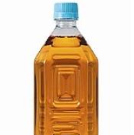

## HOMEWORK MISSION-01
첫 번째 과제 진행

## 스크린샷

](image.png)

## 어려웠던 점

- 피그마 파일을 직접 따라하는 실습이 처음이라 피그마 파일을 여는 과정, 분석하는 과정, 파일을 추출하는 과정에서 시간이 오래 걸렸다.

- 또한 막상 css를 직접 입히니까 모르는 태그들이 많아서 알아보는 것도 무척이나 시간이 걸렸다.

- 뒤늦게 조원분께 여쭤봐서 flex 라는 속성을 사용하여 주요 이미지와 텍스트들을 배치한 후에 버튼을 따로 속성을 지정하여 만드는 것이 더 편리하다는 것을 깨달았지만 시간이 없어서 position: absolute로 진행하는 수 밖에 없었다.

- 현재 버튼 내에서 자꾸 배경이 겹쳐보이는 이슈가 발생하는데 그 이슈를 결국 해결하지 못해서 우선 제출하게 되었다. 해결하는 대로 다시 수정하여 제출할 생각이다. border는 이미 none 속성을 사용하여 감출 수 있었는데도 불구하고 배경이 자꾸만 사라지지 않는다..

(+)

2023.11.05. - 1차 수정

겹쳐 보이는 속성이 버튼의 기본 패딩값이라는 것을 알게 되었다. 그래서 버튼의 기본 할당 패딩값을 padding: 0; 을 추가해서 오류를 수정하였다. 추후로 알게 된 것이 있다면 보통 버튼의 기본 할당값을 바꾸기 위해서 * { padding:0; margin:0} 을 추가하면 더욱 편하다는 것을 알게 되었다. 또한 하나 더 배운 게 있다면 flex 속성과 함께 wrap으로 감싸면 더욱 확대, 축소하였을 때 안 깨져서 좋다는 것 또한 다시 배울 수 있었다.

2023.11.07. - 2차 수정

position: absolute, images의 넘버링이 잘못 되었던 점, 피그마 시안을 제대로 살피지 않아 hover 버튼 속성이 사라졌던 점 등등 고칠 것이 너무 많아서 과제를 전부 다시 작성했다. 감사하게도 아이스티 회고 조 팀원분들 덕에 정말 하나씩 실습하면서 작성해볼 수 있었는데, position을 주는 것보다 display 속성을 사용해야 부모와 자식 속성과 태그들이 꼬이지 않는다는 것을 깨달았다. 버튼 속성을 줄 때도 hover 을 before이라는 가상 요소를 선택해서 주는 방법을 사용했는데 덕분에 가상 요소 사용법과 전체적으로 html의 구조와 틀을 짜는 법도 다시 익힐 수 있었다. 코드 오류가 생기지 않도록 넘버링도 다시 진행했는데, 정말 다 갈아엎은 수준의 코드였지만.. 그만큼 유의미한 과제였다. 비슷한 속성끼리 묶는 것이나 레이아웃 구조를 보는 눈이 조금은 생긴 것 같다. 그리고 확실히 묶은 이후에는 코드가 훨씬 간결하고 눈에 더 잘 들어오게 되었다.


## 회고
처음으로 내 힘으로 제대로 작성한 이후에야 html이랑 css 감이 잡히는 것 같다. 초반에는 이미 배운 내용을 굳이 다시 배울 필요가 있을까 싶었는데 이렇게까지 깊게 공부해본 적은 처음이라 감회가 새롭다. 특히 피그마 파일을 잘 사용하면 디자인을 훌륭하게 뽑을 수 있어서 좋았다. 아쉬웠던 점은 이번주에 시간이 매우 촉박해서 과제에 목표 시간보다 덜 쏟을 수 밖에 없었는데, 그것이 아쉽다. 

코드를 작성할 때 우선 레이아웃을 그려보고, 들어가야 할 태그를 임의로 span, img, button 등을 다 넣어본 이후에야 하나씩 입력하기 시작했다. 그렇게 입력해야 조금 더 머릿속에 구조가 더욱 잘 잡히는 것 같다. 

## 사용한 도구 및 웹사이트
- 크롬 개발자 도구
- Figma
- Visual Studio Code
- https://wonit.tistory.com/314

## 과제 진행 시간 
- 2023.11.04 오전 12시~4시
- 2023.11.05 오후 2시~3시
- 2023.11.07 오후 6시~11시 

## 코드 소개 

### HTML 코드

```
<!DOCTYPE html>
<html lang="ko">

<head>
  <meta charset="UTF-8" />
  <meta name="viewport" content="width=device-width, initial-scale=1.0" />
  <link rel="stylesheet" href="./css/mission-01.css">
  <title>1차 과제</title>
</head>

<body>
  <div class="wrap">
    <!-- tea item -->
    <div class="box big-box">
      <div class="box-title">
        
        <strong>따뜻한 차 향기</strong>
      </div>
      
      <a class="button-set">
        
      </a>
    </div>
    <!-- handcream item -->
    <div class="box small-box">
      
      <strong>핸드크림 모음</strong>
      
      <a class="button-set">
        
      </a>
    </div>
    <!-- tea item -->
    <div class="box small-box">
      
      <strong>고소한 보리차</strong>
      
      <a class="button-set">
        
      </a>
    </div>
  </div>
</body>

</html>
```
### CSS 코드

```
/* 기본 설정 */

* {
  box-sizing: border-box;
}

body {
  display: flex;
  justify-content: center;
  height: 100vh;
  align-items: center;
}

.wrap {
  width: 502px;
  height: 639px;
  /* background-color: yellow; */
  display: flex;
  flex-wrap: wrap;
  gap: 16px;
}

/* 박스 설정 */

.box {
  display: flex;
  position: relative;
  /* box-sizing: border-box; */
}

.box:hover {
  border: 1px solid var(--blue-600, #0074E9);
}

.big-box {
  /* background-color: aqua; */
  width: 502px;
  height: 310px;
  justify-content: space-between;
  padding: 20px 28px;
  border: 1px solid var(--gray-500, #C4C4C4);
  background: var(--White, #FFF);
}

.box-title {
  /* background-color: red; */
  display: flex;
  flex-direction: column;
  width: 100%;
  align-items: center;
  margin-top: 55px;
}

.box-title strong {
  margin-top: 20px;
  font-size: 24px;
  color: var(--gray-800, #4E4E4E);
  text-align: center;
  font-family: Noto Sans;
  font-size: 24px;
  font-style: normal;
  font-weight: 700;
  line-height: 150%; /* 36px */
}

.small-box {
  /* background-color: blue; */
  width: 243px;
  height: 310px;
  flex-direction: column;
  align-items: center;
  padding: 14px;
  border: 1px solid var(--gray-500, #C4C4C4);
  background: var(--White, #FFF);
}

.small-box strong {
  margin-top: 10px;
  margin-bottom: 7px;
  color: var(--gray-800, #4E4E4E);
  text-align: center;
  font-family: Noto Sans;
  font-size: 18px;
  font-style: normal;
  font-weight: 700;
  line-height: 150%; 
}

.button-set {
  position: absolute;
  display: flex;
  justify-content: center;
  align-items: center;
  left: 20px;
  bottom: 20px;
  width: 42px;
  height: 42px;
  background-color: var(--opacity-20, rgba(0, 0, 0, 0.20));
}

.button-set:hover {
  display: inline-flex;
  width: 112px;
  height: 42px;
  padding: 12px 18px 13px 20px;
  justify-content: space-between;
  align-items: center;
  background: var(--blue-600, #0074E9);
}

.button-set:hover::before {
  content: '구매하기';
  color: var(--White, #FFF);

  /* Text/Medium/14 */
  font-family: Noto Sans;
  font-size: 14px;
  font-weight: 500;
  font-style: normal;
  line-height: 120%; /* 16.8px */
  display: inline-block;
}
```